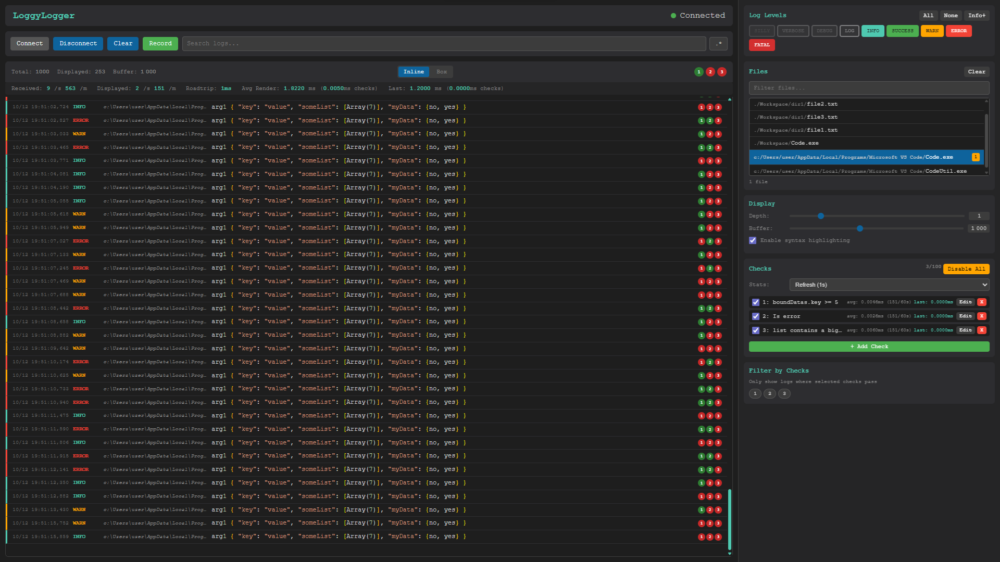
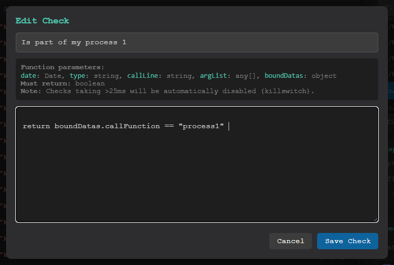
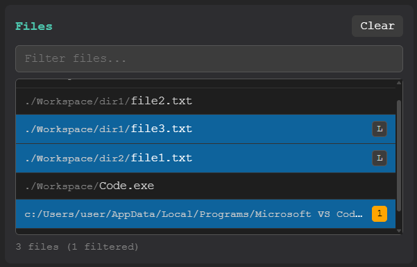

# 🚀 LoggyLogger

**Zero-config logging with a live web dashboard for Node.js.**

LoggyLogger is a standalone logging system with built-in web dashboard support. No external APIs, no cloud services - just import and log.

## ❔ Features

- 🚀 **Instant setup** - Import, create logger, done
- 🏠 **Live web dashboard** - Real-time log visualization with filtering
- ⚡ **Production mode** - Disable heavy features with one call
- 📈 **Bound data** - Attach persistent metadata to loggers for easier debugging
- 🧪 **Call line tracking** - See exactly where each log originated

## 🖼️ Screenshots

Full logging dashboard
<br><br>
Custom code snippet checks
<br><br>
Filter out logs by file and line range
<br><br>

## Install

```bash
npm install loggylogger
```

## Basic Usage

```js
import { Loggy } from 'loggylogger'

// Create a logger
const logger = Loggy.createLogger()

// Start logging
logger.info('Server started')
logger.warn('Cache miss', { userId: 42 })
logger.error('Connection failed', new Error('timeout'))
logger.debug('Request payload', requestData)
```

## Configuration

### Global Config

Use `setConfig()` to configure all loggers:

```js
import { Loggy } from 'loggylogger'

Loggy.setConfig({
    showCallLines: true,
    colors: true,
    convertObjects: true,
    convertObjectsColorized: true,
    convertObjectsDepth: 2,
    basePath: process.cwd()  // Makes call lines relative to your project
})

const logger = Loggy.createLogger()
```

### Per-Logger Config

Override global settings for specific loggers:

```js
// Quiet logger without colors
const quietLogger = Loggy.createLogger({
    level: Loggy.LEVELS['3_WARN'],
    colors: false
})

// Verbose logger for debugging
const debugLogger = Loggy.createLogger({
    level: Loggy.LEVELS['8_VERBOSE'],
    showCallLines: true,
    convertObjects: true,
    convertObjectsDepth: 5
})
```

### Bound Data

Attach persistent metadata to a logger using the second parameter or `.bind()`:
_This is espacially usefull to make logging groups accross files to show at once on dashboard_
```js
// Attach data at creation
const logger = Loggy.createLogger({}, {
    service: 'auth',
    version: '1.0.0'
})

// Or bind data to an existing logger
const requestLogger = logger.bind({
    requestId: req.id,
    userId: user.id
})

requestLogger.info('Processing request')
// Output includes: { service: 'auth', version: '1.0.0', requestId: '...', userId: '...' }
```

## Live Dashboard

Start a web dashboard to view logs in real-time:

```js
import { Loggy } from 'loggylogger'

// Start dashboard on port 11000 (default)
Loggy.startDashboard()

// Or specify a custom port
Loggy.startDashboard(3000)

// Stop when done
Loggy.stopDashboard()
```

## Production Mode

Enable production mode to disable heavy features and only log critical messages:
_When set to false, functionnalities are replaced by empty functions to remove avoid processing_
```js
import { Loggy } from 'loggylogger'

Loggy.enableProduction({
    // Enable/disable specific log levels.
    logs: {
        fatal: true,
        error: true,
        warn: true,
        info: false,
        debug: false
    },
    // Override settings in production.
    settings: {
        colors: false,
        objectInspect: false,
        callLine: false
    },
    // Optionally enable dashboard in production
    dashboard: false
}, 11000)  // Optionnal, dashboard port if enabled (default: 11000)
```

Disable production mode on runtime (not fully supported & not recommended):

```js
Loggy.disableProduction()
```

You may restart production later on without specifying again the config by simply doing
```js
Loggy.enableProduction()
```

## Log Levels

9 levels from critical to silly:

```js
logger.fatal('System crash')        // Level 10 - Highest priority
logger.error('Operation failed')    // Level 20
logger.warn('Deprecation notice')   // Level 30
logger.success('Task completed')    // Level 40
logger.info('Status update')        // Level 50
logger.log('General message')       // Level 60 - Default mode
logger.debug('Debug info')          // Level 70
logger.verbose('Detailed trace')    // Level 80
logger.silly('Very precise trace')  // Level 90 - Lowest priority
```

Set the threshold level:

```js
// Only show logs at or above this level
Loggy.setLevel(Loggy.LEVELS['7_DEBUG'])

// Or via setConfig
Loggy.setConfig({ level: Loggy.LEVELS['5_INFO'] })
```

## Configuration Options

| Option | Type | Default | Description |
|--------|------|---------|-------------|
| `level` | number | 60 | Log level threshold (use `Loggy.LEVELS`) |
| `colors` | boolean | true | Enable ANSI colors in output |
| `emojis` | boolean | true | Show emoji indicators |
| `showCallLines` | boolean | false | Show file:line for each log |
| `cleanDate` | boolean | true | Clean timestamp format |
| `convertObjects` | boolean | false | Deep inspect objects with `util.inspect` |
| `convertObjectsColorized` | boolean | true | Colorize inspected objects |
| `convertObjectsDepth` | number | 2 | Depth for object inspection |
| `basePath` | string | - | Base path for relative call line paths |

## Available Levels

```js
Loggy.LEVELS = {
    'DEFAULT': 60,
    '1_FATAL': 10,
    '2_ERROR': 20,
    '3_WARN': 30,
    '4_SUCCESS': 40,
    '5_INFO': 50,
    '6_LOG': 60,
    '7_DEBUG': 70,
    '8_VERBOSE': 80
    '9_SILLY': 90,
}
```

## API Reference

### Loggy (default instance)

| Method | Description |
|--------|-------------|
| `createLogger(config?, boundData?)` | Create a new logger instance |
| `setConfig(config)` | Set global configuration |
| `setLevel(level)` | Set global log level |
| `getLevel()` | Get current log level |
| `toggleColors(value?)` | Toggle color output |
| `startDashboard(port?)` | Start the web dashboard |
| `stopDashboard()` | Stop the web dashboard |
| `enableProduction(config?, port?)` | Enable production mode |
| `disableProduction()` | Disable production mode |
| `isProduction()` | Check if production mode is enabled |

### Logger Instance

| Method | Description |
|--------|-------------|
| `fatal(...args)` | Log fatal error |
| `error(...args)` | Log error |
| `warn(...args)` | Log warning |
| `success(...args)` | Log success |
| `info(...args)` | Log info |
| `log(...args)` | Log general message |
| `debug(...args)` | Log debug info |
| `verbose(...args)` | Log verbose details |
| `bind(data)` | Create logger with additional bound data |